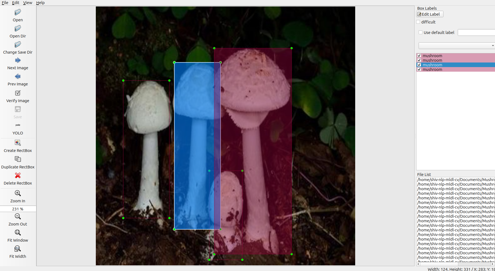
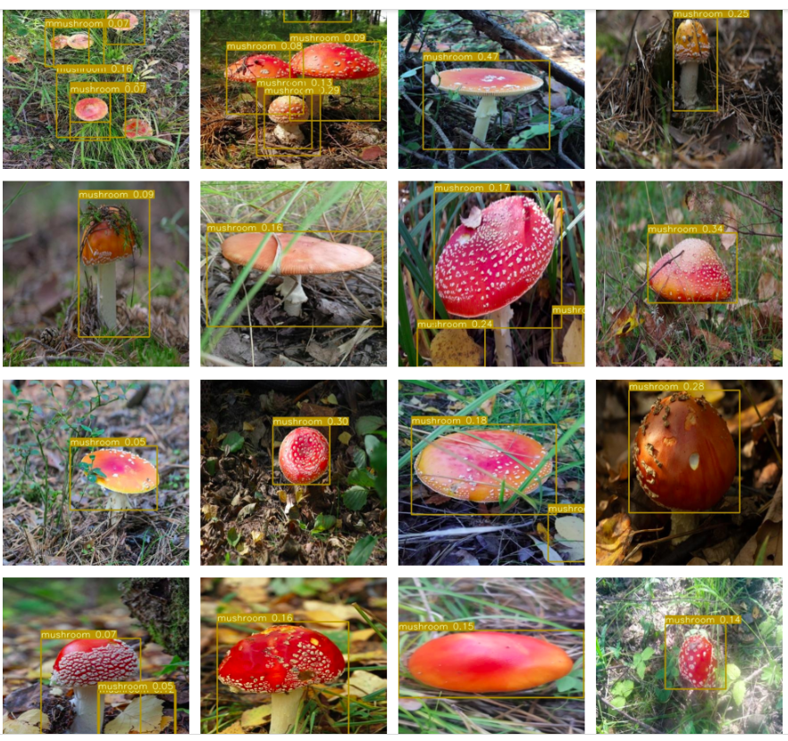

# YoloV3

## YoloV3 training with custom dataset. 


Above is image of labelImg studio

We have added a very 'small' Coco sample imageset in the folder called smalcoco. 
This is to make sure you can run it without issues on Colab.

### The code has been taken from [this](https://github.com/ultralytics/yolov3) and more details can be found

We need to download the weights from the original source. 
- Create a folder called weights in the root (YoloV3) folder
- We need to download weights from: https://drive.google.com/file/d/1vRDkpAiNdqHORTUImkrpD7kK_DkCcMus/view?usp=share_link
- We place weights 'yolov3-spp-ultralytics.pt' file in the weights folder:
- run this command to test whehter everything is working
`python train.py --data data/smalcoco/smalcoco.data --batch 10 --cache --epochs 25 --nosave`

## Data download from Kaggle
`kaggle_import.py` - This script will be used download the dataset from kaggle. This script requires setting user_id and token_id in form of environment variable
`resize-image.py` - This script will be resize the image in 416*416 and save in different directory.

## For custom dataset:
- Clone this repo: https://github.com/miki998/YoloV3_Annotation_Tool
- Follow the installation steps as mentioned in the repo. 
- For this assignment, we downloaded 100 images of your unique object. 
- We have used labelImg to annotate the image and can be setup form https://github.com/HumanSignal/label-studio Refer the image above.
- The folder structure is shown below:

```
data
  --customdata
    --images/
      --R_0medium.jpg
      --R_10medium.jpg
      --...
    --labels/
      --R_0medium.txt
      --R_10medium.txt
      --...

- We need to create **custom.data** file  
    - custom.data #path for data file
    ------------Content-------------------------
    classes=1 
      train=data/customdata/custom.txt
      names=data/customdata/custom.names

    - custom.names #class names
    ------------Content-------------------------
      mushroom   
    
    - custom.txt  #list of name of the images that needs to be trained
    ------------Content-------------------------
      ./data/customdata/images/R_92medium.jpeg
      ./data/customdata/images/R_66medium.jpeg
      ./data/customdata/images/R_0medium.jpg
      ./data/customdata/images/R_26medium.jpeg
      ./data/customdata/images/R_63medium.jpg
```
- Here mushroom has class index of 0. 
  ```
  - data/customdata/labels/R_0medium.txt
  ------------Content-------------------------
    0 0.515625 0.408654 0.646635 0.403846
  ``` 
- For COCO's 80 classes, VOLOv3's output vector has 255 dimensions ( (4+1+80)*3). Now we have 1 class, so we would need to change it's architecture.
- We need to copy the contents of 'yolov3-spp.cfg' file to a new file called 'yolov3-custom.cfg' file in the data/cfg folder. 
- We need to search for `filters=255` and we get 3 entries. We need to `change 255 to 18` = (4+1+1)*3
- We need to find `classes=80` and change all three entries to `classes=1`
- Since there is limitation of computaion environment and working with very few samples, we need to change
  - burn_in to 100
  - max_batches to 5000
  - steps to 4000,4500
- We need to command `python train.py --data data/customdata/custom.data --batch 10 --cache --cfg cfg/yolov3-custom.cfg --epochs 25 --nosave`

**Results**
After training for 25 Epochs in CPU, the ouput is decent and below are the 16 images which got detected



## Accuracy
```
 mAP@0.5        F1
 0.837          0.805
```

## Training Logs
```
Starting training for 25 epochs...

     Epoch   gpu_mem      GIoU       obj       cls     total   targets  img_size
/usr/lib/python3.10/multiprocessing/popen_fork.py:66: RuntimeWarning: os.fork() was called. os.fork() is incompatible with multithreaded code, and JAX is multithreaded, so this will likely lead to a deadlock.
  self.pid = os.fork()
      0/24        0G      6.48      80.8         0      87.3        18       512: 100% 10/10 [03:09<00:00, 18.94s/it]
               Class    Images   Targets         P         R   mAP@0.5        F1:   0% 0/10 [00:00<?, ?it/s]/usr/lib/python3.10/multiprocessing/popen_fork.py:66: RuntimeWarning: os.fork() was called. os.fork() is incompatible with multithreaded code, and JAX is multithreaded, so this will likely lead to a deadlock.
  self.pid = os.fork()
/usr/local/lib/python3.10/dist-packages/torch/functional.py:507: UserWarning: torch.meshgrid: in an upcoming release, it will be required to pass the indexing argument. (Triggered internally at ../aten/src/ATen/native/TensorShape.cpp:3549.)
  return _VF.meshgrid(tensors, **kwargs)  # type: ignore[attr-defined]
               Class    Images   Targets         P         R   mAP@0.5        F1: 100% 10/10 [01:45<00:00, 10.55s/it]
                 all       100       131         0         0  0.000432         0

     Epoch   gpu_mem      GIoU       obj       cls     total   targets  img_size
      1/24        0G      5.41      5.95         0      11.4        17       512: 100% 10/10 [02:57<00:00, 17.79s/it]
               Class    Images   Targets         P         R   mAP@0.5        F1: 100% 10/10 [01:42<00:00, 10.24s/it]
                 all       100       131         0         0  0.000623         0

     Epoch   gpu_mem      GIoU       obj       cls     total   targets  img_size
      2/24        0G      4.74       2.7         0      7.44        17       512: 100% 10/10 [02:57<00:00, 17.79s/it]
               Class    Images   Targets         P         R   mAP@0.5        F1: 100% 10/10 [00:59<00:00,  5.91s/it]
                 all       100       131         0         0   0.00295         0

     Epoch   gpu_mem      GIoU       obj       cls     total   targets  img_size
      3/24        0G      4.65      3.13         0      7.78        23       512: 100% 10/10 [02:58<00:00, 17.84s/it]
               Class    Images   Targets         P         R   mAP@0.5        F1: 100% 10/10 [00:54<00:00,  5.48s/it]
                 all       100       131         0         0    0.0117         0

     Epoch   gpu_mem      GIoU       obj       cls     total   targets  img_size
      4/24        0G      4.02      3.57         0      7.59        20       512: 100% 10/10 [02:58<00:00, 17.89s/it]
               Class    Images   Targets         P         R   mAP@0.5        F1: 100% 10/10 [00:55<00:00,  5.51s/it]
                 all       100       131         1   0.00763    0.0528    0.0152

     Epoch   gpu_mem      GIoU       obj       cls     total   targets  img_size
      5/24        0G         4      3.41         0      7.42        22       512: 100% 10/10 [02:58<00:00, 17.86s/it]
               Class    Images   Targets         P         R   mAP@0.5        F1: 100% 10/10 [00:54<00:00,  5.47s/it]
                 all       100       131         1   0.00763     0.251    0.0152

     Epoch   gpu_mem      GIoU       obj       cls     total   targets  img_size
      6/24        0G      4.43      3.33         0      7.76        25       512: 100% 10/10 [03:02<00:00, 18.22s/it]
               Class    Images   Targets         P         R   mAP@0.5        F1: 100% 10/10 [00:54<00:00,  5.46s/it]
                 all       100       131         1   0.00763     0.302    0.0152

     Epoch   gpu_mem      GIoU       obj       cls     total   targets  img_size
      7/24        0G      3.84      3.15         0         7        22       512: 100% 10/10 [02:57<00:00, 17.74s/it]
               Class    Images   Targets         P         R   mAP@0.5        F1: 100% 10/10 [00:54<00:00,  5.41s/it]
                 all       100       131         0         0     0.368         0

     Epoch   gpu_mem      GIoU       obj       cls     total   targets  img_size
      8/24        0G      3.04       2.4         0      5.44        19       512: 100% 10/10 [02:56<00:00, 17.63s/it]
               Class    Images   Targets         P         R   mAP@0.5        F1: 100% 10/10 [00:54<00:00,  5.41s/it]
                 all       100       131         1    0.0101     0.557      0.02

     Epoch   gpu_mem      GIoU       obj       cls     total   targets  img_size
      9/24        0G      3.83       2.5         0      6.34        19       512: 100% 10/10 [02:54<00:00, 17.44s/it]
               Class    Images   Targets         P         R   mAP@0.5        F1: 100% 10/10 [00:53<00:00,  5.38s/it]
                 all       100       131     0.787     0.141     0.483     0.239

     Epoch   gpu_mem      GIoU       obj       cls     total   targets  img_size
     10/24        0G      3.65      2.51         0      6.16        25       512: 100% 10/10 [02:57<00:00, 17.79s/it]
               Class    Images   Targets         P         R   mAP@0.5        F1: 100% 10/10 [00:53<00:00,  5.35s/it]
                 all       100       131     0.753     0.441     0.572     0.556

     Epoch   gpu_mem      GIoU       obj       cls     total   targets  img_size
     11/24        0G      2.39      1.98         0      4.37        20       512: 100% 10/10 [02:55<00:00, 17.57s/it]
               Class    Images   Targets         P         R   mAP@0.5        F1: 100% 10/10 [00:54<00:00,  5.47s/it]
                 all       100       131     0.656     0.627     0.619     0.642

     Epoch   gpu_mem      GIoU       obj       cls     total   targets  img_size
     12/24        0G      2.89       1.7         0      4.59        14       512: 100% 10/10 [03:00<00:00, 18.07s/it]
               Class    Images   Targets         P         R   mAP@0.5        F1: 100% 10/10 [00:54<00:00,  5.42s/it]
                 all       100       131     0.531     0.695     0.608     0.602

     Epoch   gpu_mem      GIoU       obj       cls     total   targets  img_size
     13/24        0G       2.8      1.52         0      4.32        18       512: 100% 10/10 [02:55<00:00, 17.57s/it]
               Class    Images   Targets         P         R   mAP@0.5        F1: 100% 10/10 [00:53<00:00,  5.33s/it]
                 all       100       131     0.613     0.718     0.664     0.661

     Epoch   gpu_mem      GIoU       obj       cls     total   targets  img_size
     14/24        0G      3.09      1.34         0      4.43        19       512: 100% 10/10 [02:54<00:00, 17.40s/it]
               Class    Images   Targets         P         R   mAP@0.5        F1: 100% 10/10 [00:53<00:00,  5.33s/it]
                 all       100       131     0.662     0.756     0.745     0.706

     Epoch   gpu_mem      GIoU       obj       cls     total   targets  img_size
     15/24        0G      2.08      1.25         0      3.33        17       512: 100% 10/10 [02:55<00:00, 17.52s/it]
               Class    Images   Targets         P         R   mAP@0.5        F1: 100% 10/10 [00:54<00:00,  5.40s/it]
                 all       100       131     0.668     0.751     0.754     0.707

     Epoch   gpu_mem      GIoU       obj       cls     total   targets  img_size
     16/24        0G      2.49      1.45         0      3.94        20       512: 100% 10/10 [02:54<00:00, 17.43s/it]
               Class    Images   Targets         P         R   mAP@0.5        F1: 100% 10/10 [00:53<00:00,  5.33s/it]
                 all       100       131     0.716     0.756     0.764     0.735

     Epoch   gpu_mem      GIoU       obj       cls     total   targets  img_size
     17/24        0G      1.86      1.28         0      3.14        23       512: 100% 10/10 [02:53<00:00, 17.38s/it]
               Class    Images   Targets         P         R   mAP@0.5        F1: 100% 10/10 [00:52<00:00,  5.29s/it]
                 all       100       131     0.736     0.756     0.782     0.746

     Epoch   gpu_mem      GIoU       obj       cls     total   targets  img_size
     18/24        0G       2.8      1.25         0      4.05        21       512: 100% 10/10 [02:52<00:00, 17.22s/it]
               Class    Images   Targets         P         R   mAP@0.5        F1: 100% 10/10 [00:53<00:00,  5.31s/it]
                 all       100       131     0.796     0.756     0.806     0.776

     Epoch   gpu_mem      GIoU       obj       cls     total   targets  img_size
     19/24        0G      2.57      1.16         0      3.73        22       512: 100% 10/10 [02:55<00:00, 17.55s/it]
               Class    Images   Targets         P         R   mAP@0.5        F1: 100% 10/10 [00:54<00:00,  5.40s/it]
                 all       100       131     0.804     0.748     0.795     0.775

     Epoch   gpu_mem      GIoU       obj       cls     total   targets  img_size
     20/24        0G      2.37      1.15         0      3.52        22       512: 100% 10/10 [02:54<00:00, 17.40s/it]
               Class    Images   Targets         P         R   mAP@0.5        F1: 100% 10/10 [00:53<00:00,  5.34s/it]
                 all       100       131     0.832     0.763     0.833     0.796

     Epoch   gpu_mem      GIoU       obj       cls     total   targets  img_size
     21/24        0G      2.05      1.12         0      3.17        18       512: 100% 10/10 [02:53<00:00, 17.39s/it]
               Class    Images   Targets         P         R   mAP@0.5        F1: 100% 10/10 [00:52<00:00,  5.24s/it]
                 all       100       131     0.823     0.743     0.823     0.781

     Epoch   gpu_mem      GIoU       obj       cls     total   targets  img_size
     22/24        0G      2.08      1.16         0      3.24        20       512: 100% 10/10 [02:55<00:00, 17.56s/it]
               Class    Images   Targets         P         R   mAP@0.5        F1: 100% 10/10 [00:53<00:00,  5.33s/it]
                 all       100       131     0.794     0.766      0.84      0.78

     Epoch   gpu_mem      GIoU       obj       cls     total   targets  img_size
     23/24        0G      3.13      1.23         0      4.36        24       512: 100% 10/10 [02:54<00:00, 17.45s/it]
               Class    Images   Targets         P         R   mAP@0.5        F1: 100% 10/10 [00:53<00:00,  5.33s/it]
                 all       100       131     0.815     0.775     0.838     0.794

     Epoch   gpu_mem      GIoU       obj       cls     total   targets  img_size
     24/24        0G      2.25      1.06         0       3.3        22       512: 100% 10/10 [02:56<00:00, 17.61s/it]
               Class    Images   Targets         P         R   mAP@0.5        F1: 100% 10/10 [00:54<00:00,  5.45s/it]
                 all       100       131     0.813     0.796     0.837     0.805
25 epochs completed in 1.639 hours.
```
